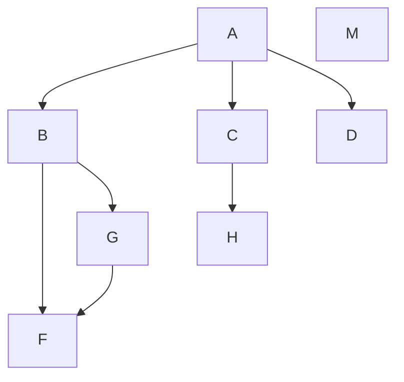

[[toc]]

# 一级标题

_斜体_

**粗体**

1. a
   1. aa
2. b

- e
- f

> 引用<br>
> 第 2 行引用内容

```
public ==class== Hello {
    public static void main(String[] args) {
        System.out.println("Hello, world!");
    }
}
```

_**代码块可以高亮显示**_

```java
public class Hello {
    public static void main(String[] args) {
        System.out.println("Hello, world!");
    }
}
```



[链接到百度](https://www.baidu.com)

## 正文换行的 2 种写法

1. 不同行之间隔一个回车
2. 上一行末尾补充 2 个空格或 1 个 Tab

## 删除线

~~无视我吧~~
